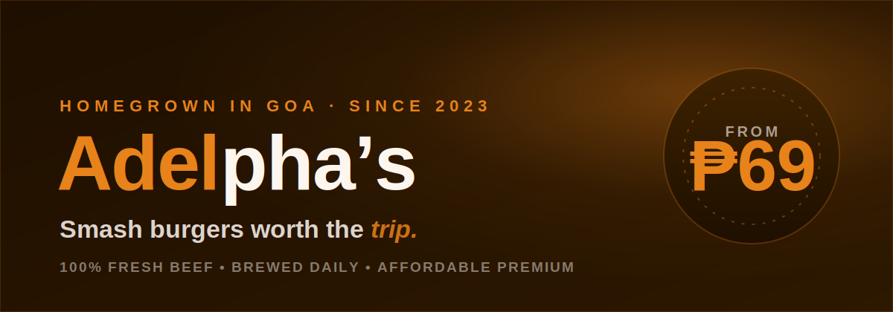

<div align="center">
  
</div>

<h1 align="center">Adelpha's Burger And Cafe</h1>

<p align="center">
  A modern, single-page website for a homegrown burger cafe in Goa, Camarines Sur.<br/>
  Warm charcoal theme, premium motion, and a full menu built to make people hungry.
</p>

<p align="center">
  
  
  
  
  
</p>

---

## About

Adelpha's Burger And Cafe is a neighborhood spot tucked behind Jollibee on San Isidro St, Goa.
This is its marketing site: one polished, scrollable page that shows off the menu, the story, and
where to find the shop, and points customers to Messenger to order.

## Features

- **Appetite-first hero** with a staggered headline reveal and scroll parallax.
- **Filterable menu** of 22 dishes with categories derived from the data (no empty tabs) and bestseller tags.
- **Premium micro-interactions** powered by Motion: a scroll-reactive nav, magnetic call-to-action buttons, count-up stats, and cursor-spotlight menu cards.
- **Working contact form** with an inline success state.
- **Story, reviews, map, and hours** sections, plus a graceful "photo coming soon" fallback for any missing image.
- Fully **responsive** and **`prefers-reduced-motion` aware**.

## Tech Stack

| Area | Choice |
|------|--------|
| Framework | React 19 + Vite 6 |
| Language | TypeScript |
| Styling | Tailwind CSS v4 (theme tokens via `@theme`) |
| Animation | Motion (`motion/react`) |
| Icons | lucide-react |

## Getting Started

**Prerequisites:** [Node.js](https://nodejs.org/) 18 or newer.

```bash
# 1. Install dependencies
npm install

# 2. Start the dev server (http://localhost:3000)
npm run dev

# 3. Build for production
npm run build

# 4. Preview the production build
npm run preview
```

## Project Structure

```
adelphas01/
├── public/
│   └── menu/            # Local menu & site photos (see menu/README.md)
├── src/
│   ├── App.tsx          # The full single-page site + motion components
│   ├── data.ts          # Menu items and reviews
│   ├── index.css        # Tailwind v4 theme tokens, fonts, keyframes
│   └── main.tsx         # App entry
└── index.html
```

## Adding Photos

Menu and story images load from local files, so they never expire. Drop the real photos into
`public/menu/` (and `public/story.jpg`) using the exact filenames listed in
[`public/menu/README.md`](./public/menu/README.md). Any image that is missing shows a branded
"photo coming soon" tile instead of a broken image.

## Deployment

The build output in `dist/` is fully static and can be hosted on any static host
(Vercel, Netlify, GitHub Pages, Cloudflare Pages):

```bash
npm run build   # outputs to dist/
```

## Credits

Designed and developed by **Anthony Azuela**.
Brand and content © Adelpha's Burger And Cafe.
